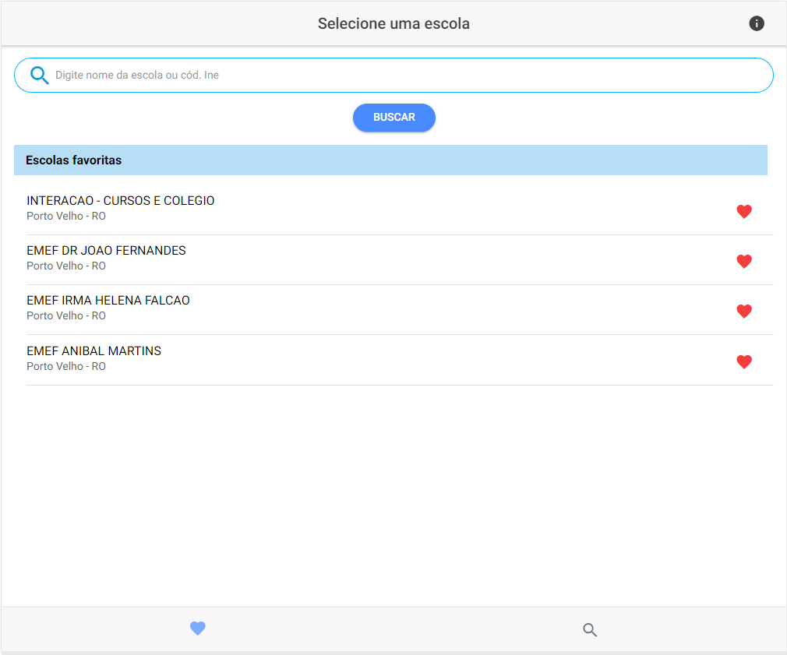
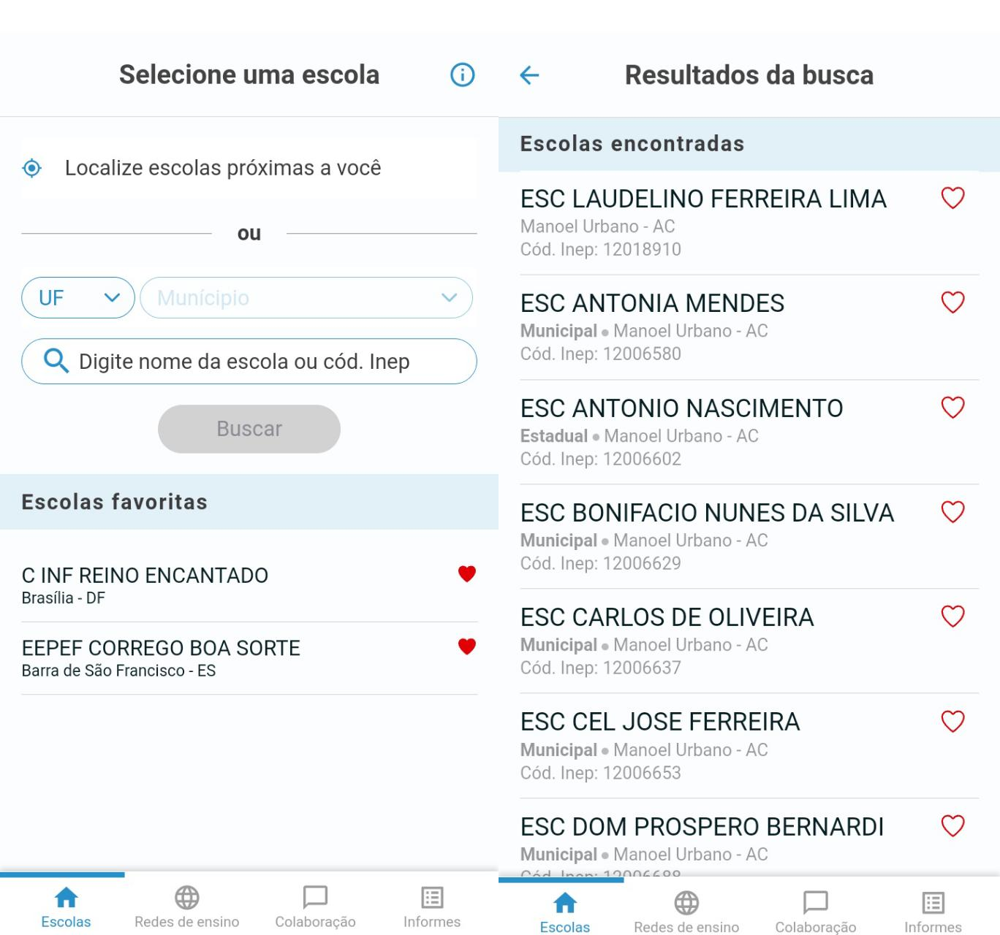
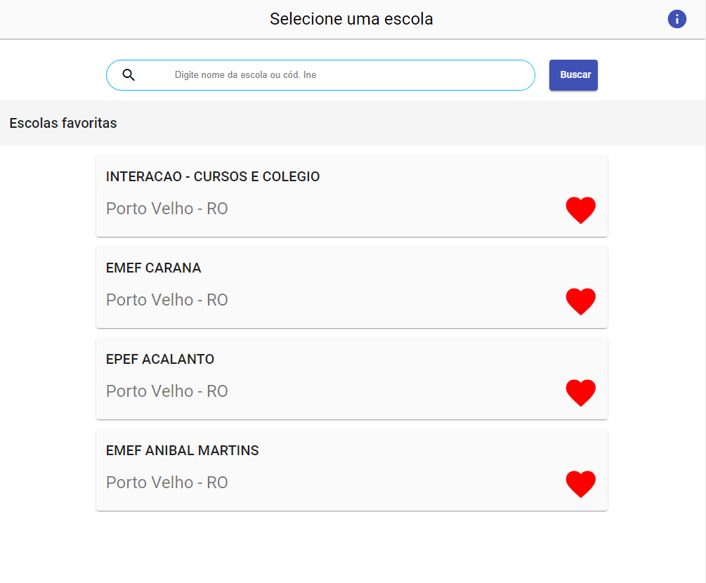
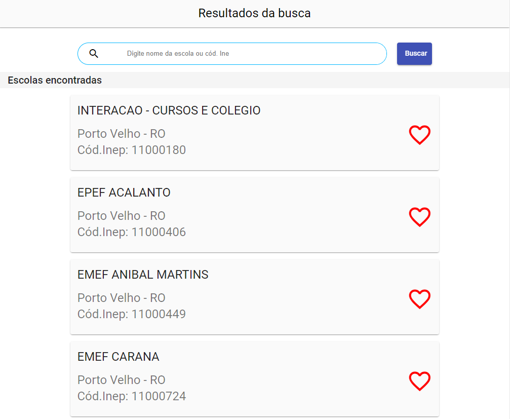
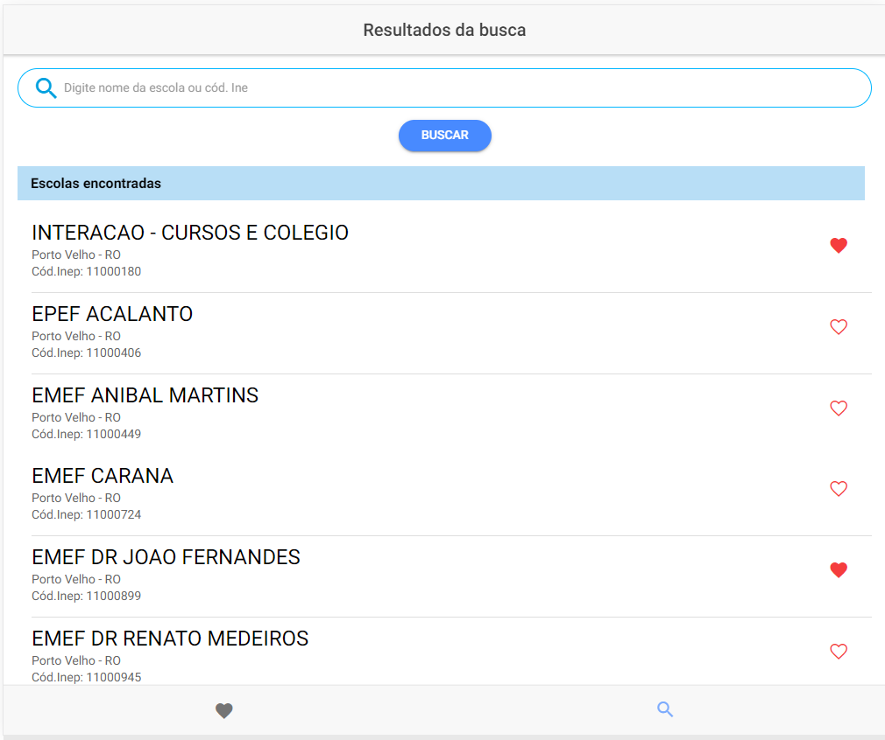

# Challenge v-lab UFPE

### Entre nos repositórios para instruções sobre as aplicações!

## Motivação

Este projeto é parte de um modelo de avaliação e recrutamento de desenvolvimento mobile para o V-Lab, no qual, fui desafiado a desenvolver um aplicativo em Ionic Cordova e Angular consumindo a Api REST de uma lista de escolas.

### O aplicativo Click Escola:

A imagem acima retrata o projeto original, cujo serviu de inspiração para criar as telas a seguir:

### Aplicação Angular

O tempo limite para conclusão do desafio foram 72h, tempo no qual tomei literalmente 24 horas para aprender a arquitetura do Angular, começando pela aplicação mobile (utilizando o framework Ionic), pois já tinha planos para aprende-lo.

### Aplicação Ionic

Embora tenha deixado diversas falhas de arquitetura, performance ou padrões, foi gratificante participar do desafio e aprender sob pressão novas tecnologias, agradeço a V-lab pela oportunidade.
