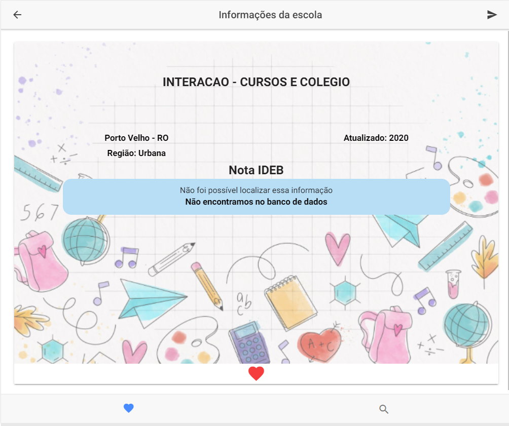

# Click Escola App

This project was generated with [Ionic Cordova](https://ionicframework.com/docs/v3/intro/installation/).



## How to install

Run:

```bash
  $ cd mobileApp
  $ npm install
```

## How to start

Run:

```bash
  $ ionic serve
```

The application will automatically reload if you change any of the source files.

## Code scaffolding

To generate a new component, Run:

```bash
  ionic generate component component-name
```

You can also use:

```bash
 ionic generate directive|service|page
```

https://ionicframework.com/docs/cli/commands/generate

## Build

To build the project run:

```bash
  ionic build
```

The build artifacts will be stored in the `dist/` directory.
