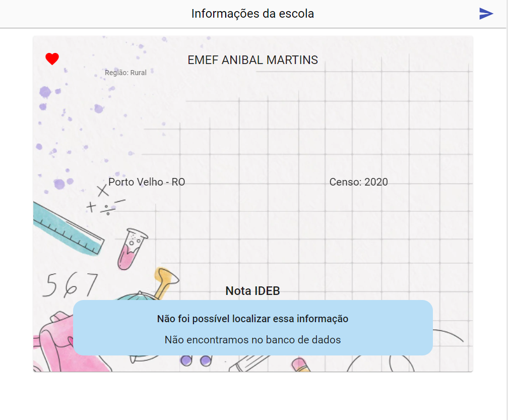

# Click Escola Web

This project was generated with [Angular CLI](https://github.com/angular/angular-cli) version 13.3.5.



## How to install

Run:

```bash
  $ cd webApp
  $ npm install
```

## How to start

Run:

```bash
  $ ng serve
```

Navigate to `http://localhost:4200/`. The application will automatically reload if you change any of the source files.

## Code scaffolding

To generate a new component, Run:

```bash
  ng generate component component-name
```

You can also use:

```bash
 ng generate directive|pipe|service|class|guard|interface|enum|module
```

## Build

To build the project run:

```bash
  ng build
```

The build artifacts will be stored in the `dist/` directory.

## Running unit tests

To execute the unit tests via [Karma](https://karma-runner.github.io).
Run

```bash
  ng test
```
